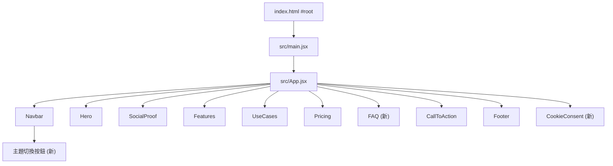

## 方案總覽

我們會先設計 **3 個 feature branch / worktree** 的拆分方案，再針對每個功能（主題切換、FAQ 區塊、Cookie 同意彈窗）規劃具體實作步驟與驗收標準。確認之後，等你允許再實際建立 worktree 並修改程式碼。

- **技術棧**: React 18 + Vite, 單頁行銷網站
- **主要檔案**:
  - App 入口: `[src/main.jsx](src/main.jsx)`、`[src/App.jsx](src/App.jsx)`
  - 全域樣式與設計系統: `[src/index.css](src/index.css)`
  - 導覽列與導航資料: `[src/components/Navbar.jsx](src/components/Navbar.jsx)`、`[src/data/navigation.js](src/data/navigation.js)`
  - 頁面區塊: Hero / Features / UseCases / Pricing / CallToAction 等在 `src/components`
  - Footer 與法務連結: `[src/components/Footer.jsx](src/components/Footer.jsx)`、`[src/data/footer.js](src/data/footer.js)`

---

## Git Worktree 拆分設計

### 1. 分支與 worktree 規劃

假設基準分支為 `main`（若你的預設分支名稱不同，後續可在實作時調整）：

- **feature/theme-toggle**
  - **Worktree 目錄**: `../git-worktree-demo-theme`
  - **功能範圍**: 新增淺色/深色主題設計與切換 UI
- **feature/faq-section**
  - **Worktree 目錄**: `../git-worktree-demo-faq`
  - **功能範圍**: 新增「常見問題 FAQ」區塊與導覽連結
- **feature/cookie-consent-banner**
  - **Worktree 目錄**: `../git-worktree-demo-cookie-consent`
  - **功能範圍**: 新增 Cookie 同意彈窗（banner），與既有 Cookie 政策連結整合

> 命名遵守 Skill 建議：worktree 放在 repo 同層級 (`../`)，格式為 `git-worktree-demo-<feature-short-name>`。

### 2. 預計指令（確認後才執行）

> 下列指令僅在你接受計畫後才會實際執行，現在只是規劃。

```bash
# 基礎：確認目前狀態（僅查詢）
git branch --show-current
git worktree list
git status --short

# 建立 theme worktree（如分支尚未存在）
git worktree add -b feature/theme-toggle ../git-worktree-demo-theme main

# 建立 FAQ worktree
git worktree add -b feature/faq-section ../git-worktree-demo-faq main

# 建立 Cookie consent worktree
git worktree add -b feature/cookie-consent-banner ../git-worktree-demo-cookie-consent main
```

- 每個 worktree 建立後，再依 lock 檔決定使用 `npm install` / `yarn install` / `pnpm install`。
- 為每個 worktree 在根目錄產生一份 `git-worktree-spec.md`，寫入對應 Feature 的 Spec（見下）。

---

## Feature Spec：Light/Dark 主題 + 切換

### 1. 目標

- 提供 **淺色 / 深色** 兩套主題配色，並支援：
  - 依使用者上次選擇記憶主題（localStorage）
  - 第一次載入時，依 `prefers-color-scheme` 自動選擇預設主題
  - 導覽列中有明顯的主題切換按鈕（icon 或文字）

### 2. 實作範圍

- **CSS 主題結構（`src/index.css`）**
  - 建立以 `data-theme` 為基礎的變數架構：
    - `:root[data-theme="light"] { ... }`
    - `:root[data-theme="dark"] { ... }`
  - 將現有顏色變數整理為「主題中立」名稱（如 `--color-bg`, `--color-surface`, `--color-primary`, `--color-text`），並分別給出 light / dark 兩套值。
  - 盡量把主題差異集中在顏色與陰影，不大幅改動 layout，降低 merge 衝突。
- **主題狀態管理（`src/App.jsx`）**
  - 在 `App` 中加入：
    - `theme` state（`'light' | 'dark'`）
    - 初始化邏輯：
      - 若 localStorage 有 `theme`，使用該值
      - 否則依 `window.matchMedia('(prefers-color-scheme: dark)')` 判斷
    - `useEffect`：每次 theme 變更時，更新 `document.documentElement.dataset.theme`，並寫入 localStorage。
  - 將 `theme` 和 `toggleTheme` 以 props 傳給 `Navbar`。
- **切換 UI（`src/components/Navbar.jsx`）**
  - 在桌面版與行動版導覽中增加一個主題切換按鈕：
    - 例如 icon：太陽 / 月亮；或文字：「淺色 / 深色」。
    - 點擊時呼叫 `toggleTheme`。
  - 按鈕樣式延伸自既有按鈕設計（`btn`、`btn-secondary`）並在 `index.css` 中加上 `.theme-toggle` 修飾。

### 3. 驗收標準

- 重整頁面後能保持上次選擇的主題。
- 切換主題不會破壞既有排版，可讀性良好（按鈕、文字、卡片對比足夠）。
- 預設行為：未選擇過主題時，跟隨系統深淺色偏好。

---

## Feature Spec：常見 QA 問答區（FAQ）

### 1. 目標

- 在單頁中新增「常見問題」區塊，支援：
  - 導覽列有「常見問題」錨點連結
  - 問題列表可清楚瀏覽，每個條目顯示問題與回答
  - 風格與現有 section 一致（標題、兩欄 / 單欄布局、高度、間距等）

### 2. 實作範圍

- **資料層（`src/data/faq.js`）**
  - 新增 FAQ 資料檔，形如：
    - `[{ question, answer, category? }]`，例如 6–8 個典型 SaaS CRM 問答（試用、合約、資料安全、整合等）。
- **UI 區塊（`src/components/FAQ.jsx`）**
  - 建立 `FAQ` section component，採用現有 section 模板：
    - 外層 `<section id="faq" className="section faq">`，搭配 `.section-header` 樣式。
    - 內容區使用 grid 或 column 風格展示問題（依現有 `.features-grid` 或 `.use-cases-grid` 當參考）。
  - 可選：實作簡單的展開 / 收合交互（用 `useState` 管理展開的問題 id），但保持無依賴、易讀。
- **整合版面（`src/App.jsx` & `src/data/navigation.js`）**
  - 在 `[src/App.jsx](src/App.jsx)` 的 `<main>` 內加入 `<FAQ />`：
    - 建議插入於 `Pricing` 與 `CallToAction` 之間（使用者看完價格後立刻看到常見問題）。
  - 在 `[src/data/navigation.js](src/data/navigation.js)` 增加一筆：
    - `{ label: '常見問題', href: '#faq' }`
  - 確保 Navbar 區塊會顯示並滾動到新 section。
- **樣式（`src/index.css`）**
  - 在現有 section 樣式之後新增 FAQ 專屬 class，如 `.faq`, `.faq-list`, `.faq-item`, `.faq-question`, `.faq-answer`。
  - 保持與其他 section 一致的 spacing / typography。

### 3. 驗收標準

- Navbar 中點擊「常見問題」可順利捲動至 FAQ 區塊。
- FAQ 條目在桌機與手機版排版正常，無溢出或重疊。
- 文案採繁體中文，與整體 tone 一致。

---

## Feature Spec：Cookie 同意彈窗（Banner）

### 1. 目標

- 在頁面下方顯示一個 Cookie 使用說明與同意按鈕的 banner：
  - 第一次造訪或尚未同意時顯示。
  - 點擊「接受」後隱藏，並在 localStorage 記錄狀態。
  - 提供「了解更多」連結，導向 Footer 的「Cookie 政策」連結或錨點。

### 2. 實作範圍

- **React 組件（`src/components/CookieConsent.jsx`）**
  - 建立 `CookieConsent` component：
    - 使用 `useState` 管理是否顯示。
    - 在 `useEffect` 中讀取 localStorage，例如 key: `cookie_consent`。
    - 若未同意，render 一個固定在畫面底部的 banner；已同意則不 render。
    - 按鈕：
      - 「接受」：將 `cookie_consent=accepted` 寫入 localStorage，並隱藏。
      - 「了解更多」：連結到 Footer 中的「Cookie 政策」（沿用 `[src/data/footer.js](src/data/footer.js)` 中的連結或 `href="#"` 先占位）。
- **掛載位置（`src/App.jsx`）**
  - 在 `App` 最外層結構中（`<Footer />` 之後）掛載：
    - 保持結構類似：
      - `Navbar` → `<main>...</main>` → `Footer` → `CookieConsent`。
  - 確保 banner 不會壓住重要 CTA（可調整 z-index 與 padding）。
- **樣式（`src/index.css`）**
  - 新增 `.cookie-banner`, `.cookie-banner__content`, `.cookie-banner__actions` 相關樣式：
    - 固定在 viewport 底部（`position: fixed; bottom: 0; left: 0; right: 0;`）。
    - 使用現有設計系統變數（背景、文字顏色、按鈕）以支援 light/dark 兩主題。
    - 在小螢幕上堆疊內容與按鈕，避免超出寬度。

### 3. 驗收標準

- 首次載入時出現 banner，再次載入（已接受）時不再顯示。
- 按照不同主題（light/dark）顯示時，banner 仍具可讀性與對比度。
- 不影響主要內容滾動與 CTA 按鈕點擊，無 layout 抽動（避免 CLS 問題）。

---

## 可能的合併順序與衝突管理

- **建議合併順序**：
  1. `feature/theme-toggle`（主題系統會影響其他元件視覺）
  2. `feature/faq-section`（新增獨立 section，對其他功能影響小）
  3. `feature/cookie-consent-banner`（依賴最終主題與頁面結構）
- **潛在衝突點**：
  - `src/App.jsx`：三個 feature 都可能增減 import / JSX section（FAQ 新 section、Cookie banner 新 component、主題 state 增加）。
  - `src/index.css`：主題變數、FAQ 樣式、Cookie banner 樣式都會在此增改。
- **降低衝突的做法**：
  - 在各分支中，新增 CSS 區塊儘量集中在檔案末尾，並以明確註解區隔（如 `/* FAQ */`、`/* Cookie banner */`）。
  - 在 `App.jsx` 中，盡量維持 section 順序一致，只單純插入新的 JSX 區塊與 props，不重排既有結構。

---

## Mermaid：頁面結構與新元件關係




此圖說明我們會在 `App.jsx` 新增 FAQ 與 CookieConsent 組件，並在 Navbar 中加入主題切換 UI，同時維持原有 section 架構。